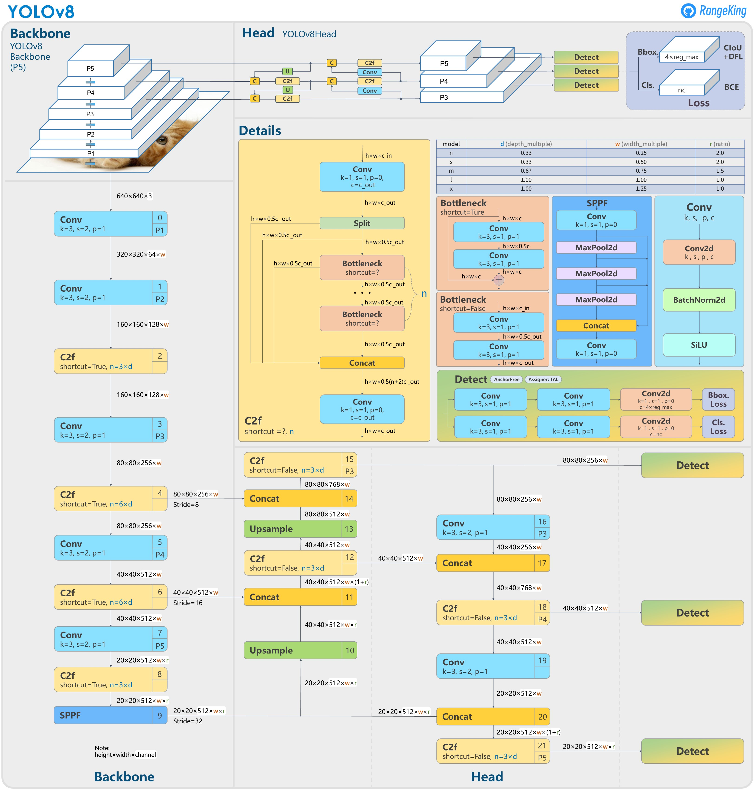

# YOLOv8 implementation in Python with Tensorflow 2

This repo aims to develop an implementation of YOLOv8 in Python with Tensorflow 2 in order to be Quantized on FPGA latter.

This work is part of my master thesis in computer science at the University of Geneva.

Here is the model structure : 

That comes from [a git issue opened by RangeKing on github](https://github.com/ultralytics/ultralytics/issues/189)